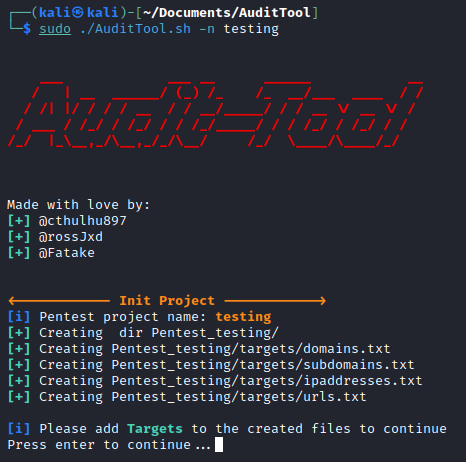

# Audit Tool



## Functions

Audit Tool are mainly bash scripts to automate repetitive tasks dunring a pentest.
You could be able to make:

- Test security headers
- Transofrm hosts into IPv4 or IPv6 addresses
- Scan ports and services with **Nmap**
- A Nessus scan
- A DNS analysis with tools like **dnsrecon**, **dig**, **subfinder**, **assetfinder** and **amass**
- Create New Burp project
- Take screenshots from a list of URLs with **GoWitness**

## Onliner Install
```bash
curl https://raw.githubusercontent.com/Fatake/AuditTool/master/install.sh | sudo bash
```

## Usage

Clone github repository

```bash
git clone --recursive https://github.com/Fatake/AuditTool.git
```

All you need to do is:

```bash
sudo bash AuditTool.sh -n [NameProject]
```

For the first time, the script will create a directory called **pentest**, inside ther whill create other directory called **targets** where you will tipe all targets that yu need to audit:

- domains.txt
- ipaddresses.txt
- subdomains.txt
- urls.txt
